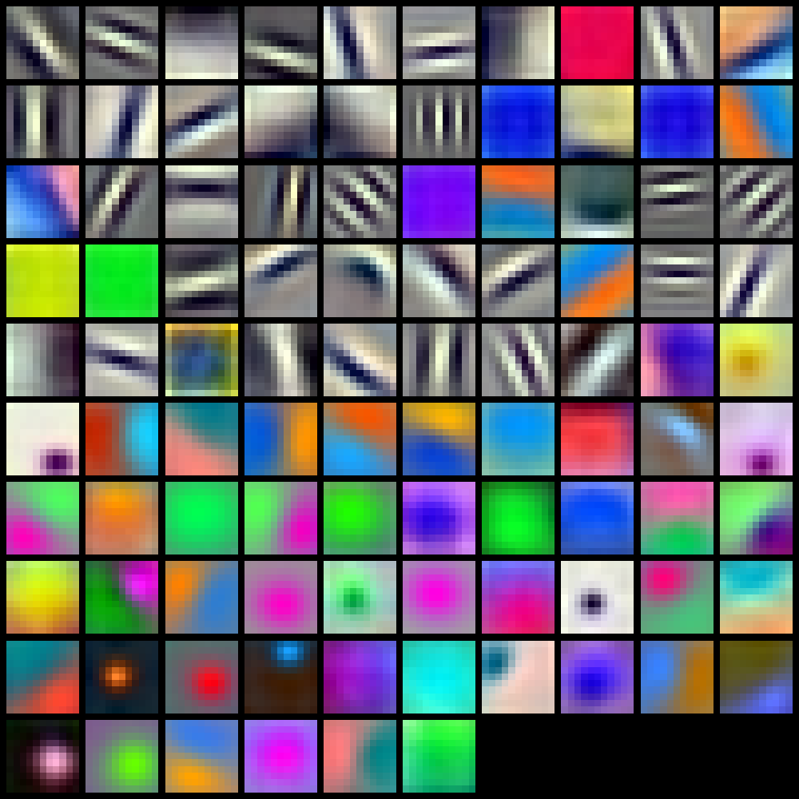

# AlexNet on ImageNet 2010 (ILSVRC-2010)

## Introduction to AlexNet

AlexNet is a deep convolutional neural network with 5 convolutional and 3 fully connected layers (about 60M parameters) that won the ImageNet LSVRC-2010 challenge by a large margin, demonstrating the power of large CNNs trained on GPUs for large-scale image classification.

---

## ImageNet 2010 dataset
ILSVRC-2010 uses a subset of ImageNet with 1,000 object categories and roughly 1.2–1.3M training images, plus 50k validation and 150k test images.

---

## Results of Reproduction
| Model                         | Top-1 error | Top-5 error |
|-------------------------------|------------:|------------:|
| *AlexNet (Original)*   | *37.5%*   | *17.0%*   |
| **AlexNet (Reproduction)**   | **39.88%**   | **18.71%**   |
---

## Graphs

Source:  
Krizhevsky, A., Sutskever, I., & Hinton, G. E. *ImageNet Classification with Deep Convolutional Neural Networks*, NIPS 2012. 